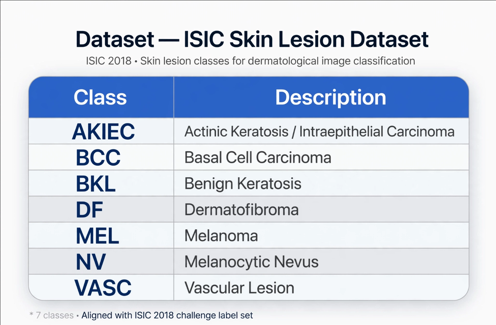
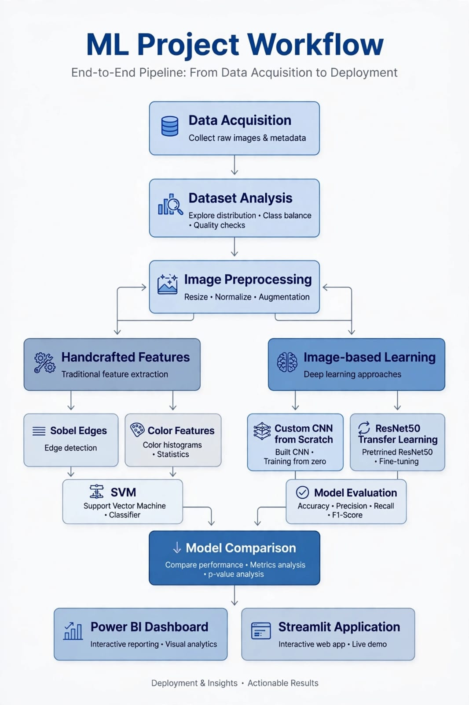
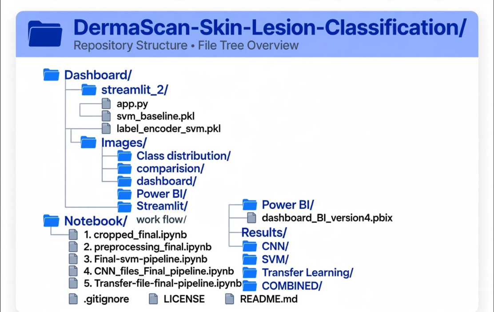

# DermaScan — AI-Powered Skin Lesion Classification

**Multi-model skin lesion classification using SVM, a custom CNN, and ResNet50 transfer learning.**

[](https://www.python.org/)
[](https://pytorch.org/)
[](https://scikit-learn.org/)
[](https://streamlit.io/)
[](LICENSE)

---

## Table of Contents

- [Overview](#overview)
- [Project Objectives](#project-objectives)
- [Dataset](#dataset)
- [Pipeline](#pipeline)
- [Image Preprocessing](#image-preprocessing)
- [Handcrafted Feature Extraction](#handcrafted-feature-extraction)
- [Models](#models)
  - [1. SVM](#1-svm)
  - [2. Custom CNN](#2-custom-cnn)
  - [3. ResNet50 Transfer Learning](#3-resnet50-transfer-learning)
- [Model Comparison](#model-comparison)
- [Statistical Comparison — McNemar's Test](#statistical-comparison--mcnemars-test)
- [Power BI Dashboard](#power-bi-dashboard)
- [Streamlit Application](#streamlit-application)
- [Repository Structure](#repository-structure)
- [Technologies Used](#technologies-used)
- [Project Results](#project-results)
- [Getting Started](#getting-started)
- [Notebooks](#notebooks)
- [Limitations](#limitations)
- [Future Improvements](#future-improvements)
- [Author](#author)
- [License](#license)

---

## Overview

**DermaScan** is an end-to-end computer vision and machine learning project for classifying dermoscopic skin lesion images into multiple lesion categories. It compares three modeling approaches:

- **SVM** with handcrafted image features
- **Custom CNN** built from scratch in PyTorch
- **ResNet50** transfer learning

The project includes full model evaluation, confusion-matrix analysis, class-wise performance breakdowns, McNemar's statistical test, a Power BI dashboard, and a Streamlit application.

> **Scope:** DermaScan is designed for **screening and analytical decision support**, not clinical diagnosis. It is not a replacement for a qualified medical professional.

## Project Objectives

- Build an end-to-end skin lesion image classification pipeline
- Preprocess and standardize dermoscopic images
- Extract handcrafted image features for a traditional ML baseline
- Develop a custom CNN architecture in PyTorch
- Apply transfer learning using a pre-trained ResNet50 model
- Compare classical ML and deep learning approaches
- Evaluate models using accuracy, precision, recall, F1-score, and confusion matrices
- Statistically compare model predictions using McNemar's test
- Present results through Power BI and Streamlit

## Dataset

The project uses the **ISIC** skin lesion dataset of labeled dermoscopic images across seven lesion categories:


The dataset exhibits substantial class imbalance; distribution was analyzed and imbalance-handling techniques were incorporated during model development.

## Pipeline




## Image Preprocessing

The preprocessing pipeline prepares raw dermoscopic images for model training:

- Removal of unwanted circular / black image borders
- Resizing to 224 × 224
- Pixel normalization
- Training-set data augmentation:
  - Rotation
  - Horizontal / vertical flipping
  - Brightness adjustment
  - Cropping

Reusable preprocessing functions (resizing, normalization, augmentation) were implemented using **NumPy** and **PIL**.

## Handcrafted Feature Extraction

For the traditional machine learning approach, images were converted into numerical feature vectors:

- **Edge features** — Sobel edge detection
- **Color features** — HSV, LAB, color histograms
- **Texture features** — GLCM (Gray-Level Co-occurrence Matrix): contrast, homogeneity, energy, correlation

These features, along with additional image statistics, provide a non-deep-learning baseline for comparison against the CNN-based approaches.

## Models

### 1. SVM

A Support Vector Machine trained on handcrafted image features.

**Pipeline**
```
Handcrafted Features → StandardScaler → Variance Threshold → RBF SVM → 7-Class Prediction
```

**Configuration**

| Component | Choice |
|---|---|
| Kernel | RBF |
| Class balancing | Balanced class weights |
| Feature scaling | StandardScaler |
| Hyperparameter tuning | GridSearchCV |
| Cross-validation | Stratified K-Fold |

**Test Performance**

| Metric | SVM |
|---|---|
| Accuracy | 74.32% |
| Weighted F1-score | 75.48% |

### 2. Custom CNN

A convolutional neural network designed and trained from scratch in PyTorch (not a pre-trained architecture), using:

- Convolution layers
- Batch normalization
- ReLU activation
- Max pooling
- Adaptive average pooling
- Dropout
- Fully connected classification layer

**Training setup:** weighted cross-entropy loss, class weights, training-time augmentation, validation monitoring, learning-rate scheduling.

**Test Performance**

| Metric | Custom CNN |
|---|---|
| Accuracy | 72% |

### 3. ResNet50 Transfer Learning

A ResNet50 model pre-trained on ImageNet, adapted for 7-class skin lesion classification.

**Approach**
```
Pre-trained ResNet50 → Replace Final Classification Layer → Adapt for 7 Classes
→ Fine-Tune Selected Layers → Skin Lesion Classification
```

Selected layers were fine-tuned using different learning rates per parameter group.

**Test Performance**

| Metric | ResNet50 |
|---|---|
| Accuracy | 85% |
| Weighted F1-score | 84% |
| Macro F1-score | 77% |

## Model Comparison

| Model | Approach | Test Accuracy |
|---|---|---|
| SVM | Handcrafted features + RBF SVM | 74.32% |
| Custom CNN | CNN trained from scratch | 72% |
| **ResNet50** | Transfer learning | **85%** |

**Key observation:** ResNet50 transfer learning achieved the highest test accuracy, outperforming both the custom CNN and the handcrafted-feature SVM baseline — demonstrating the advantage of features learned from a large-scale pre-trained vision model on a complex image classification task.

## Statistical Comparison — McNemar's Test

Accuracy alone does not capture the full picture. McNemar's test was used to determine whether differences in paired model predictions were statistically significant.

| Comparison | Test Statistic | p-value |
|---|---|---|
| CNN vs. ResNet50 | 37.4016 | 9.614 × 10⁻¹⁰ |
| CNN vs. SVM | 12.5998 | 3.858 × 10⁻⁴ |
| ResNet50 vs. SVM | 58.8446 | 1.706 × 10⁻¹⁴ |

All pairwise comparisons show statistically significant differences in prediction behavior at conventional significance levels. McNemar's test was chosen because all classifiers were evaluated on the same test observations, making paired analysis appropriate.

## Power BI Dashboard

An interactive Power BI dashboard presents the model results and analytical findings, including:

- Model accuracy comparison
- Classification metrics
- Class-wise performance
- Confusion matrices
- Dataset distribution
- Model comparison visualizations
- Statistical test results
- Training performance information

## Streamlit Application

An interactive Streamlit application provides:

- Model overview
- CNN analysis
- Transfer learning analysis
- SVM analysis
- Class-wise analysis
- McNemar's test results
- Prediction explorer
- Confusion matrices
- Classification metrics
- Model comparison

## Repository Structure



## Technologies Used

| Category | Tools |
|---|---|
| Programming & Development | Python, Jupyter Notebook, Google Colab, Kaggle |
| Machine Learning | Scikit-learn, SVM, PCA, GridSearchCV, Cross-validation |
| Deep Learning | PyTorch, Torchvision, CNN, ResNet50, Transfer Learning |
| Image Processing | OpenCV, PIL, NumPy, scikit-image |
| Data Analysis & Visualization | Pandas, Matplotlib, Seaborn, Plotly |
| Dashboard & Deployment | Power BI, Streamlit |

## Project Results

Exported results for each model and the combined analysis are available under `Results/`:

- **`Results/CNN/`** — Training history, predictions, classification reports, confusion matrices, dataset split info, summary metrics
- **`Results/SVM/`** — Cross-validation results, predictions, classification reports, confusion matrices, dataset split info, summary metrics
- **`Results/Transfer Learning/`** — Training history, predictions, classification reports, confusion matrices, dataset split info, summary metrics
- **`Results/COMBINED/`** — Combined model metrics, combined predictions, combined confusion matrix, classification metrics, McNemar test results


## Notebooks

| Notebook | Purpose |
|---|---|
| `1. cropped_final.ipynb` | Image cropping / preparation |
| `2. preprocessing_final.ipynb` | Image preprocessing |
| `3. Final-svm-pipeline.ipynb` | Handcrafted features and SVM |
| `4. CNN_files_Final_pipeline.ipynb` | Custom CNN |
| `5. Transfer-file-final-pipeline.ipynb` | ResNet50 transfer learning |

## Limitations

- The dataset contains class imbalance, which can affect minority-class performance.
- Model performance depends on the quality and distribution of the training data.
- The system should not be treated as a medical diagnostic tool.
- Further validation on independent clinical datasets is required before any real-world clinical use.
- Large trained model weights are not included in the repository.
- Accuracy alone is insufficient for medical classification tasks — precision, recall, F1-score, and confusion matrices should all be considered.

## Future Improvements

- Larger and more diverse datasets
- Improved handling of class imbalance
- Additional transfer-learning architectures
- Hyperparameter optimization
- More extensive external validation
- Improved explainability analysis
- Model compression for deployment
- Cloud-based deployment
- Integration with additional clinical metadata

## Author

**Sandheep Sunil Das**
MSc Project — *DermaScan: AI-Powered Skin Lesion Classification*

## License

This project is licensed under the [MIT License](LICENSE).

---

*Developed as an academic machine learning and computer vision project exploring the comparison of traditional machine learning, custom deep learning, and transfer learning approaches for skin lesion image classification.*
